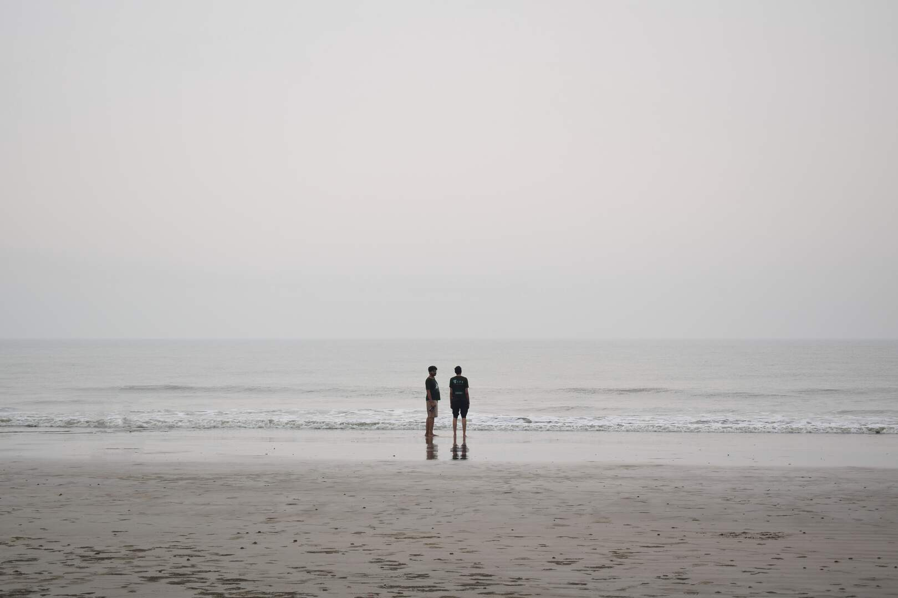

+++
title = "Now"
path = "now"
+++

>(This is a [now](https://nownownow.com/about) page. Basically what I have been up to lately.)

- I have a series of tests and assignment deadlines coming up; and there are other important things too. So, it's really stressful right now.
- I can see that my chances of getting selected in GSoC are almost nil. This is the thing I am most stressed about. 
- My LFX mentorship is going smoothly. There is not much *load* and it's enjoyable.
- Applied for Kharagpur Open Source Society(KOSS). Pretty sure I would get selected, but the task they gave is a bit challenging given the small time frame.
- Focusing on minimalism and reducing the noise in my life.
- Completed reading [Piranesi](https://www.goodreads.com/book/show/50202953-piranesi). Not reading anything at the moment.

---

**Photograph of the week** 

---

>*Last updated on 21st March, 2024*
